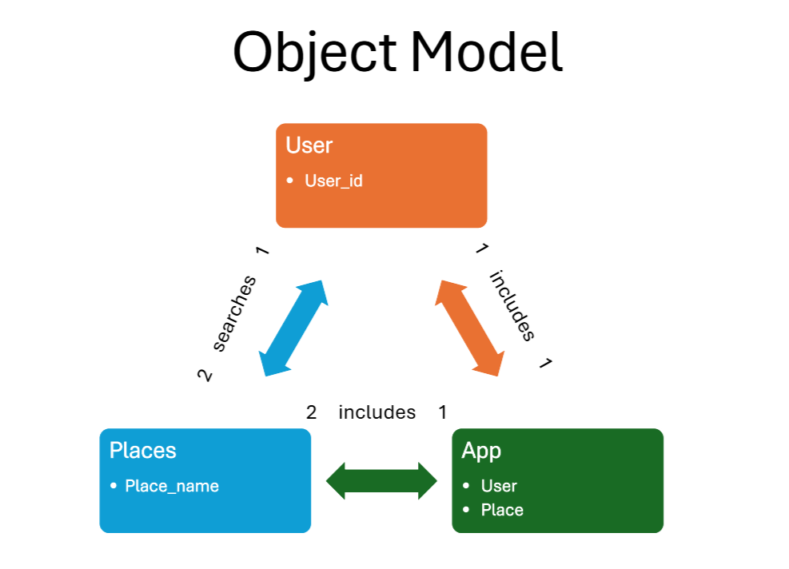
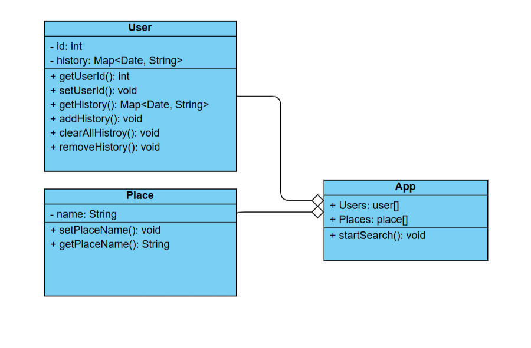

# Smart Travel app for UL dissertation

ref: OOD tutorial by Derek Banas: https://www.youtube.com/watch?v=fJW65Wo7IHI

## Requirements
USE CASE Description

A user enters the names of two places and searches the ways from one place to another.
The search result appears in the app.

Triggers

A user enters the names of two places and searches the route between them.

Actors

1. The user who searches the route
2. Two places to search
3. The app

Preconditions

1. the user is available
2. the two places are available

Goals

A user gets the result

Not Available

1. Failed result, Extensions (Alternatives)
2. Places are the same

Steps of Execution

1. A user is picked to register or sign in
2. The picked user enters two places and searches the route from one to the other
3. Search starts and page is loading
4. Result appears for the user
5. Offer to save the search history
6. The user chooses to close the page or sign out

## Object Model

## Sequence Diagram
tool ref: https://sequencediagram.org/

## Class Diagram
tool ref: https://online.visual-paradigm.com/diagrams/solutions/free-class-diagram-tool/

class diagram ref: https://online.visual-paradigm.com/app/diagrams/#diagram:proj=0&type=ClassDiagram&width=11&height=8.5&unit=inch